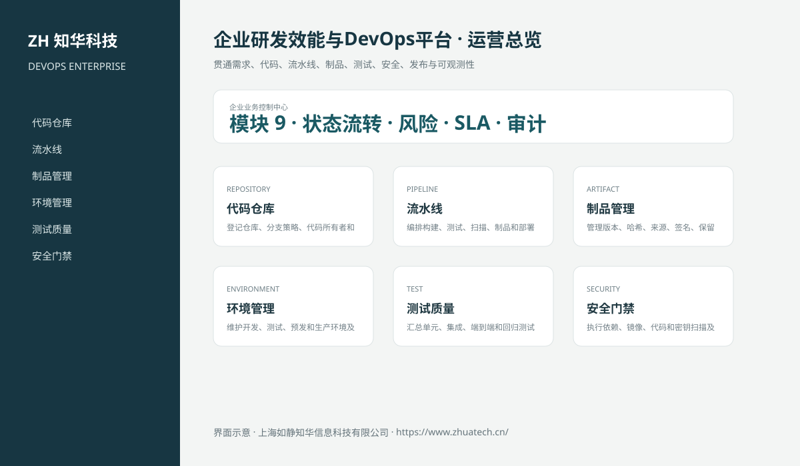

# ZhuaTech DEVOPS｜企业研发效能与DevOps平台

> 贯通需求、代码、流水线、制品、测试、安全、发布与可观测性

ZhuaTech DEVOPS 是知华科技（上海如静知华信息科技有限公司）发布的企业级源码项目，面向“代码仓库、持续集成、自动化测试、制品、环境、发布审批、安全门禁、部署与度量”提供管理端与响应式业务端。工程采用前后端分离架构，所有示例数据均为虚构数据。

[知华科技官网](https://www.zhuatech.cn/) · [架构说明](docs/ARCHITECTURE.md) · [API 文档](docs/API.md) · [企业能力](docs/ENTERPRISE.md) · [测试说明](docs/TESTING.md)



## 业务模块

| 模块 | 核心能力 |
| --- | --- |
| 代码仓库 | 登记仓库、分支策略、代码所有者和合并规则 |
| 流水线 | 编排构建、测试、扫描、制品和部署阶段 |
| 制品管理 | 管理版本、哈希、来源、签名、保留和推广 |
| 环境管理 | 维护开发、测试、预发和生产环境及配置差异 |
| 测试质量 | 汇总单元、集成、端到端和回归测试结果 |
| 安全门禁 | 执行依赖、镜像、代码和密钥扫描及例外审批 |
| 发布管理 | 管理发布单、变更窗口、审批、版本说明和回滚 |
| 部署编排 | 支持分批、蓝绿、金丝雀部署和自动回退 |
| 效能度量 | 统计交付周期、部署频率、失败率和恢复时间 |


## 专业业务深化

- 发布候选持久化保存 Commit SHA、不可变制品摘要、目标环境和回滚版本；
- 质量门禁综合测试通过率、严重漏洞、回滚准备和受控环境给出阻断项；
- 发布流程覆盖提交审批、管理员批准、制品哈希一致性校验、健康检查、部署和回滚；
- 生产发布必须关联有效 `CHG-*` 变更单与计划时间；周末冻结窗口默认阻断，仅允许已授权紧急变更进入门禁；
- 支持滚动、蓝绿、金丝雀策略，并对制品漂移或健康检查失败执行服务端阻断。

## 企业级控制

- ADMIN / OPERATOR 角色边界和管理员接口隔离；
- 服务端字段、模块、唯一编号和状态迁移校验；
- 组织、期间、责任人、风险等级、到期日和 SLA 统计；
- 支持组织/账期隔离查询、治理驾驶舱、办结率、证据缺口与同步失败监控；
- 支持最多 100 条控制项的原子批量提交、管理员批量复核和失败整体回滚；
- 支持组织账期锁定/解锁，锁定后禁止新增、提交、审批、补证和办结；
- 幂等创建、JPA 乐观锁、重复提交保护和职责分离；
- 附件 SHA-256 元数据、业务凭证完整性与全流程审计；
- 组合检索、分页、逾期筛选、UTF-8 CSV 导出和协作时间线；
- 外部系统仅预留适配器，使用方自行配置地址与凭据；
- prod profile 拒绝默认密码、弱数据库口令和本地跨域来源。

## 技术架构

- 后端：Java 21、Spring Boot、Spring Security、JPA、Bean Validation、Actuator
- 前端：Vue 3、Vite、Axios，支持桌面端与移动端响应式布局
- 数据库：MySQL 8；自动化测试使用 H2
- 交付：Docker Compose、Nginx、环境变量、GitHub Actions
- Java 包名：`cn.zhuatech.devops`

## 启动与测试

```bash
cd backend && mvn test
cd ../frontend && npm install && npm run build
cd .. && cp .env.example .env && docker compose up --build
```

开发演示账号：`admin / admin123`、`operator / operator123`。生产环境必须通过环境变量替换全部默认凭据。

## 许可与商业授权

Copyright © 2026 上海如静知华信息科技有限公司。

本工程仅允许个人学习、研究和非商业技术交流，**不得用于商业用途**。企业内部使用、生产部署、SaaS运营、项目交付、品牌替换、收费培训、咨询实施或再分发，均须事先获得上海如静知华信息科技有限公司书面授权，详见 [LICENSE](LICENSE)。

深度开发、私有化部署、系统集成与企业数字化咨询，请访问[知华科技官网](https://www.zhuatech.cn/)或扫码联系：

| 微信咨询一 | 微信咨询二 |
| --- | --- |
|  |  |

SEO：企业研发效能与DevOps平台、DEVOPS系统源码、企业数字化、Java企业系统、Vue管理系统、知华科技、上海如静知华信息科技有限公司。
